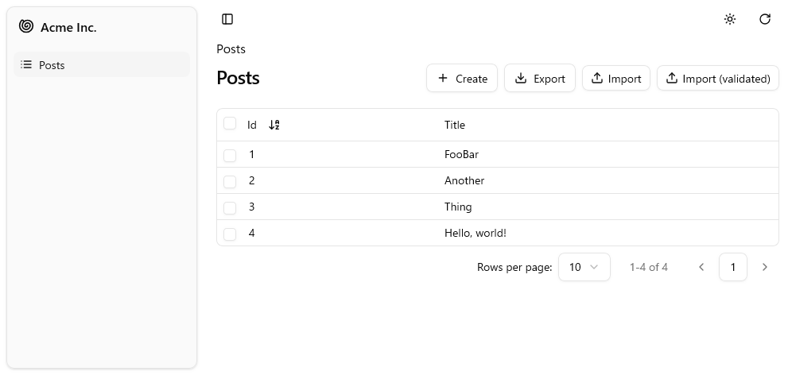
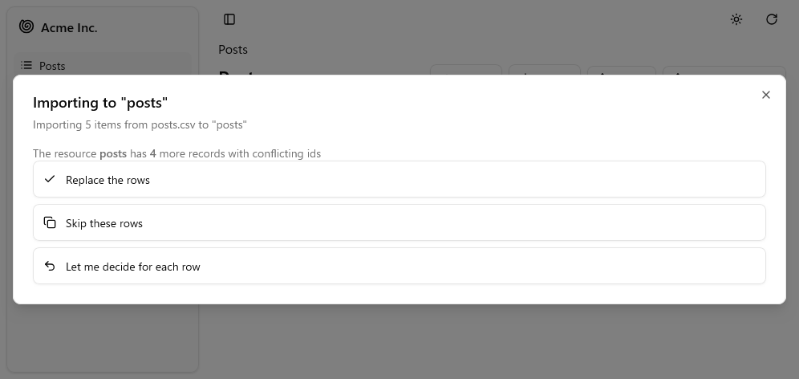
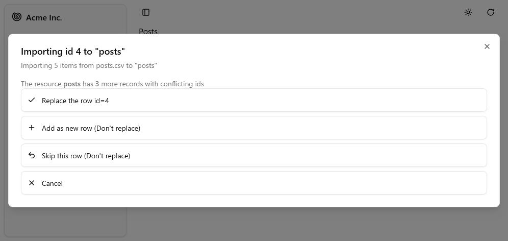
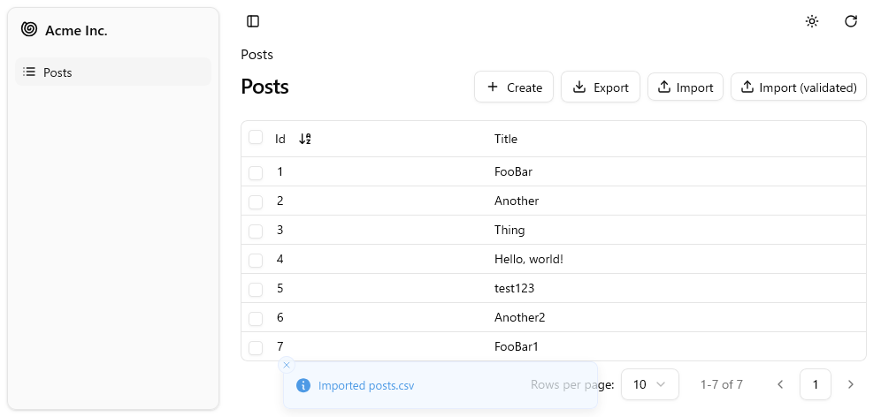

# shadcn-admin-kit-import-csv

[](https://www.npmjs.com/package/shadcn-admin-kit-import-csv)

CSV/TSV import button for [react-admin](https://github.com/marmelab/react-admin) using **shadcn/ui** + **Tailwind CSS**.

A fork of [react-admin-import-csv](https://github.com/benwinding/react-admin-import-csv) with Material UI replaced by [shadcn/ui](https://ui.shadcn.com/) components (Radix UI + Tailwind CSS).

**[Live Demo](https://tsutsu3.github.io/shadcn-admin-kit-import-csv/)**



## Features

- Import CSV/TSV files into any react-admin resource
- Collision detection — skip, replace, or decide per row
- Row validation with error toast notifications
- Bulk operations via `createMany` / `updateManyArray` with automatic fallback
- Built-in i18n (en, ja, de, es, fr, zh, ru, nl, pl, ptBR)
- shadcn/ui Dialog, Button, Tooltip components
- Tailwind CSS styling — no Material UI dependency

## Installation

```bash
npm install shadcn-admin-kit-import-csv
# or
pnpm add shadcn-admin-kit-import-csv
```

### Peer Dependencies

```bash
npm install react react-dom ra-core papaparse lucide-react \
  @radix-ui/react-dialog @radix-ui/react-tooltip @radix-ui/react-slot \
  class-variance-authority clsx tailwind-merge
```

## Usage

### Basic

```tsx
import { List, Datagrid, TextField, TopToolbar, CreateButton, ExportButton } from "react-admin";
import { ImportButton } from "shadcn-admin-kit-import-csv";

const ListActions = () => (
  <TopToolbar>
    <CreateButton />
    <ExportButton />
    <ImportButton />
  </TopToolbar>
);

export const PostList = () => (
  <List actions={<ListActions />}>
    <Datagrid>
      <TextField source="id" />
      <TextField source="title" />
    </Datagrid>
  </List>
);
```

### With Validation

You can validate each CSV row before import. If validation fails, a toast notification displays the error message and the import is aborted.

```tsx
import { ImportButton } from "shadcn-admin-kit-import-csv";

const validateRow = async (row: any) => {
  if (row.title == null || row.title === "") {
    throw new Error("CSV must contain a 'title' column");
  }
};

const ListActions = () => (
  <TopToolbar>
    <ImportButton />
    <ImportButton label="Import (validated)" validateRow={validateRow} />
  </TopToolbar>
);
```

### With Full Configuration

```tsx
import { ImportButton, ImportConfig } from "shadcn-admin-kit-import-csv";

const config: ImportConfig = {
  logging: true,
  parseConfig: { dynamicTyping: true },
  validateRow: async (row) => {
    if (!row.title) throw new Error("Title is required");
  },
  preCommitCallback: async (action, values) => {
    console.log(`Action: ${action}, Count: ${values.length}`);
    return values;
  },
  postCommitCallback: (reportItems) => {
    console.log("Import result:", reportItems);
  },
};

const ListActions = () => (
  <TopToolbar>
    <ImportButton {...config} />
  </TopToolbar>
);
```

## Import Flow

### 1. Select a CSV file

Click the **Import** button and select a `.csv` or `.tsv` file.

### 2. Collision handling

When imported rows have IDs that already exist, a strategy dialog appears:



| Option | Behavior |
| --- | --- |
| **Replace the rows** | Overwrite all conflicting records |
| **Skip these rows** | Import only non-conflicting records |
| **Let me decide for each row** | Review each conflict individually |

### 3. Per-row decisions

If you choose **"Let me decide for each row"**, a per-item dialog lets you handle each conflict:



| Option | Behavior |
| --- | --- |
| **Replace the row id=N** | Overwrite the existing record |
| **Add as new row** | Create a new record (without the conflicting ID) |
| **Skip this row** | Leave the existing record unchanged |
| **Cancel** | Abort remaining conflict resolution |

### 4. Import complete

After import, a toast notification confirms the result and the list refreshes automatically.



## Configuration Options

| Option | Type | Description |
| --- | --- | --- |
| `logging` | `boolean` | Enable debug logging |
| `label` | `string` | Custom button label |
| `resourceName` | `string` | Override the target resource name |
| `parseConfig` | `ParseConfig` | [PapaParse config](https://www.papaparse.com/docs#config) |
| `validateRow` | `(row, index?, allItems?) => Promise<void>` | Validate each row; throw to reject |
| `transformRows` | `(csvRows) => Promise<any[]>` | Transform CSV rows before processing |
| `preCommitCallback` | `(action, values) => Promise<any[]>` | Transform values before create/update |
| `postCommitCallback` | `(reportItems) => void` | Handle results after import |
| `disableCreateMany` | `boolean` | Force individual `create` calls |
| `disableUpdateMany` | `boolean` | Force individual `update` calls |
| `disableGetMany` | `boolean` | Force individual `getOne` calls |
| `disableImportNew` | `boolean` | Disable "Add as new" button |
| `disableImportOverwrite` | `boolean` | Disable "Replace" button |

## Bulk Operations

Your DataProvider can implement optional bulk methods to reduce API calls:

| Operation | Bulk Method | Fallback |
| --- | --- | --- |
| Create | `.createMany()` | `.create()` per item |
| Update | `.updateManyArray()` | `.update()` per item |
| Check existing | `.getMany()` | `.getOne()` per item |

```typescript
interface CreateManyParams {
  data: any[];
}

interface UpdateManyArrayParams {
  ids: Identifier[];
  data: any[];
}
```

## i18n

Built-in translations with automatic English fallback. To integrate with react-admin's i18n system:

```tsx
import { i18n } from "shadcn-admin-kit-import-csv";

const messages = {
  en: { ...englishMessages, ...i18n.en },
  ja: { ...japaneseMessages, ...i18n.ja },
};
```

Supported languages: English (en), Japanese (ja), German (de), Spanish (es), French (fr), Chinese (zh), Brazilian Portuguese (ptBR), Russian (ru), Dutch (nl), Polish (pl)

## Development

```bash
# Install dependencies
pnpm install

# Run tests (72 tests)
pnpm test

# Type check
pnpm typecheck

# Build
pnpm build

# Lint & format
pnpm lint
pnpm format:check
```

### Demo

```bash
cd demo
pnpm install
pnpm dev
```

## Credits

This project is a fork of [react-admin-import-csv](https://github.com/benwinding/react-admin-import-csv) by [Ben Winding](https://github.com/benwinding), with Material UI components replaced by shadcn/ui.

## License

[MIT](LICENSE) - Copyright (c) 2020 Ben Winding, 2025 tsutsu3
