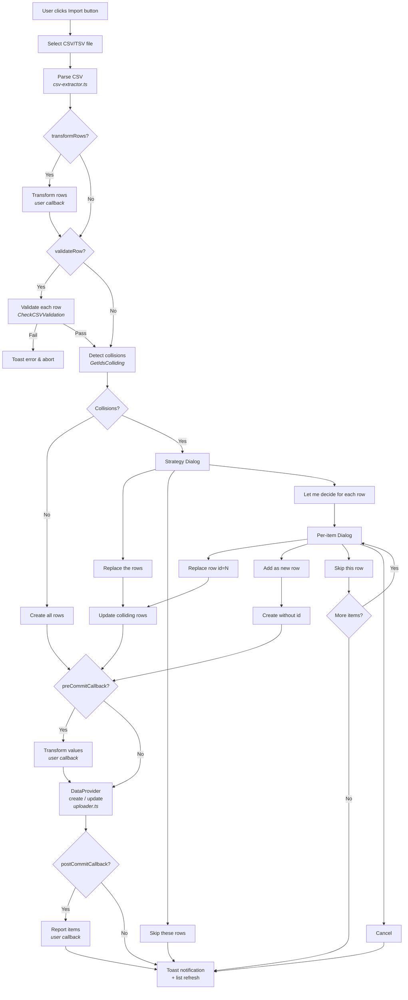

# Architecture

This document describes the internal architecture of `shadcn-admin-kit-import-csv`.

## Directory Structure

```
src/
├── index.ts                  # Public API entry point
├── config.interface.ts       # ImportConfig type definitions
├── main-csv-button.tsx       # Main orchestrator component
├── csv-extractor.ts          # CSV/TSV parsing (PapaParse)
├── import-controller.ts      # Collision detection & row validation
├── uploader.ts               # DataProvider create/update operations
├── SimpleLogger.ts           # Debug logging utility
├── translateWrapper.ts       # i18n hook (ra-core + fallback)
├── components/
│   ├── import-button.tsx               # Import button UI
│   ├── import-csv-dialog-strategy.tsx  # Conflict strategy dialog
│   ├── import-csv-dialog-each-item.tsx # Per-item decision dialog
│   ├── SharedDialogWrapper.tsx         # Dialog container
│   ├── SharedDialogButton.tsx          # Dialog action button
│   └── SharedLoader.tsx                # Loading spinner
├── ui/                       # shadcn/ui primitives
│   ├── button.tsx
│   ├── dialog.tsx
│   └── tooltip.tsx
├── lib/
│   └── utils.ts              # cn() — clsx + tailwind-merge
└── i18n/                     # Translations (10 languages)
    ├── index.ts
    ├── en.ts, ja.ts, de.ts, es.ts, fr.ts,
    ├── zh.ts, ru.ts, nl.ts, pl.ts, ptBR.ts
```

## Public API

```typescript
// Main entry point
export { ImportButton } from "./main-csv-button";
export type { ImportConfig } from "./config.interface";
export * as i18n from "./i18n";
```

The library exposes two package exports:

| Entry | Path | Contents |
| --- | --- | --- |
| `shadcn-admin-kit-import-csv` | `dist/index.js` | `ImportButton` component + `ImportConfig` type |
| `shadcn-admin-kit-import-csv/i18n` | `dist/i18n/index.js` | Translation objects for 10 languages |

## Data Flow



## Module Responsibilities

### main-csv-button.tsx — Orchestrator

The central component that manages the entire import lifecycle.

- Holds all React state (file, values, conflicts, dialog open/close)
- Coordinates the parse → validate → detect → create/update pipeline inside a `useEffect` triggered by file selection
- Renders child dialog components based on current state
- Uses ra-core hooks: `useDataProvider`, `useNotify`, `useRefresh`, `useResourceContext`

### csv-extractor.ts — CSV Parsing

Wraps PapaParse to convert a `File` into an array of row objects.

- `processCsvFile(file, config)` — reads file and parses CSV/TSV
- `processCsvData(data)` — converts PapaParse's array-of-arrays into objects using the first row as headers
- Supports nested dot-notation keys (e.g. `"address.city"` → `{ address: { city: "..." } }`)

### import-controller.ts — Validation & Collision Detection

Three main functions:

| Function | Purpose |
| --- | --- |
| `GetCSVItems()` | Parse file → validate non-empty → return rows |
| `CheckCSVValidation()` | Run `validateRow()` on each row; throw original error message on failure |
| `GetIdsColliding()` | Query DataProvider for existing IDs; return list of conflicting IDs |

`GetIdsColliding` tries `dataProvider.getMany()` first, then falls back to individual `dataProvider.getOne()` calls if `getMany` is unsupported or `disableGetMany` is set.

### uploader.ts — DataProvider Operations

Handles record creation and updates with batch-first strategy:

| Operation | Primary | Fallback |
| --- | --- | --- |
| Create | `dataProvider.createMany()` | `dataProvider.create()` per item |
| Update | `dataProvider.updateManyArray()` | `dataProvider.update()` per item |

Each operation returns `ReportItem[]` with `{ value, success, err?, response? }` for post-processing.

### translateWrapper.ts — i18n Hook

`useTranslateWrapper()` wraps ra-core's `useTranslate()` with a fallback chain:

1. Try ra-core's translation system
2. Fall back to built-in English translations (`i18n/en.ts`)
3. Return the raw key if no translation found

Supports `%{key}` placeholder interpolation.

## Component Hierarchy

```
ImportButton (main-csv-button.tsx)
├── ImportButtonUI (components/import-button.tsx)
│   ├── Button (ui/button.tsx)
│   ├── Tooltip (ui/tooltip.tsx)
│   └── <input type="file" />
│
├── ImportCsvDialogStrategy (components/import-csv-dialog-strategy.tsx)
│   ├── SharedDialogWrapper
│   │   └── Dialog (ui/dialog.tsx)
│   ├── SharedLoader
│   └── SharedDialogButton ×3 (Replace / Skip / Let me decide)
│
└── ImportCsvDialogEachItem (components/import-csv-dialog-each-item.tsx)
    ├── SharedDialogWrapper
    ├── SharedLoader
    └── SharedDialogButton ×4 (Replace / Add as new / Skip / Cancel)
```

## Build

The library is built with **Vite** in library mode:

- **Entry points**: `src/index.ts` and `src/i18n/index.ts`
- **Output formats**: ESM (`.js`) + CJS (`.cjs`)
- **Type declarations**: Generated by `vite-plugin-dts` + `tsc --project tsconfig.build.json`
- **Externals**: All peer dependencies (react, ra-core, @radix-ui/\*, etc.) are excluded from the bundle

```bash
npm run build    # vite build && tsc --project tsconfig.build.json
```

## Tests

72 tests across 6 test suites using **Vitest**:

| Suite | File | Tests | Scope |
| --- | --- | --- | --- |
| SimpleLogger | `SimpleLogger.test.ts` | 6 | Logging utility |
| csv-extractor | `csv-extractor.test.ts` | 6 | CSV parsing, dot-notation |
| import-controller | `import-controller.test.ts` | 15 | Collision detection, validation |
| uploader | `uploader.test.ts` | 13 | Create/update with batch fallback |
| ui-components | `ui-components.test.tsx` | 23 | Dialog and button components |
| main-csv-button | `main-csv-button.test.tsx` | 9 | Integration: full import flow |

Component tests use `@testing-library/react` with jsdom. Radix UI portal components are mocked to avoid DOM issues in the test environment.
